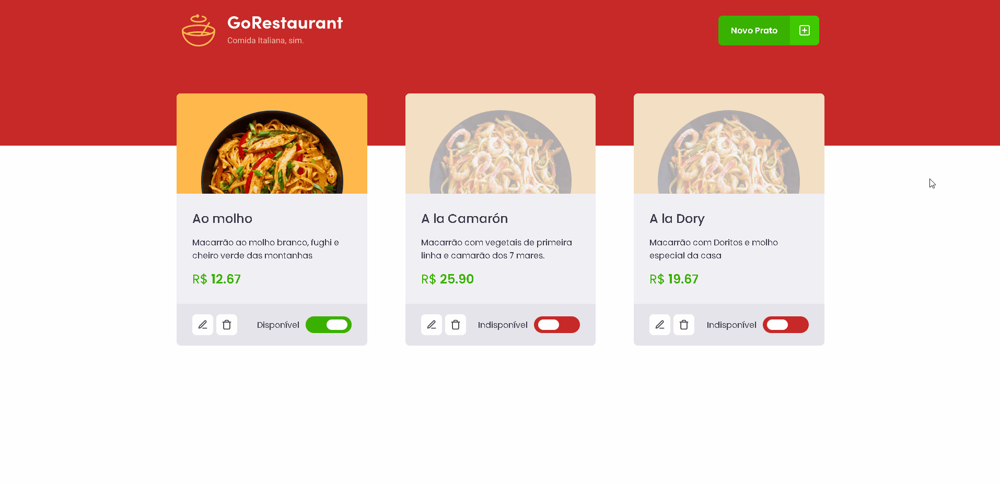
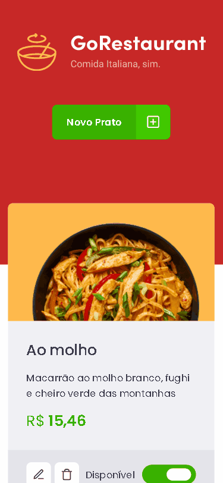

<h1 align="center">
  
</h1>

## **<h2 align="center">Front end application  💻</h2>**

## 
<h2 align="center">Application for food registration in a restaurant developed in Ignite's fourth challenge delivered by [Rocketseat](https://app.rocketseat.com.br/dashboard)</h2> 

## 
  

<h3>In addition to the proposed challenge, animations were added, some minor changes in CSS were made and I developed the entire responsive layout for the mobile version</h3>

  <a href="#computer-demonstration-of-the-application-web">Demonstration of the application</a>&nbsp;&nbsp;&nbsp;|&nbsp;&nbsp;&nbsp;
  <a href="#star-features">Features</a>&nbsp;&nbsp;&nbsp;|&nbsp;&nbsp;&nbsp;
  <a href="#rocket-technologies-used">Technologies used</a>&nbsp;&nbsp;&nbsp;|&nbsp;&nbsp;&nbsp;
  <a href="#information_source-application-installation">Application installation</a>

# :computer: Demonstration of the application Web

  

 

<h3 align="center"> 
	 Application status: Developed ✔️
</h3>
 

# **Demonstration of the application - Mobile Layout** 📱

  

 

## :star: Features
- [x] Add a new dish
- [x] Remove an existing dish
- [x] Mark a dish as unavailable/available
- [x] Edit a dish already registered

## :rocket: Technologies used:

 

## :information_source: Application installation
- `git clone https://github.com/mathwcruz/ignite-desafio_04-trilha-reactjs-gorestaurant.git` to clone the repository

 

# 🎲 Run application
To run the application on the web, follow the instructions from your terminal:
- `cd ignite-desafio_04-trilha-reactjs-gorestaurant` and `code .`
- run `yarn` to install the dependencies of the project
- run `yarn server` to run the server on `localhost:3333`
- After that, run `yarn start` to run the application, will open at the address `localhost:3000`

 

### Autor
---

<a href="https://app.rocketseat.com.br/me/matheus-da-cruz-frontend">
 
  
 <b>Matheus da Cruz</b></a> <a href="https://app.rocketseat.com.br/me/matheus-da-cruz-frontend" title="Rocketseat">  🚀</a>

Desenvolvido por Matheus da Cruz 😊

 

 

## **
Starting the walk to be able to participate in the marathon in this world of programming 🏃‍
**

### 
 <h2 align="center">Another application by Matheus da Cruz 👨‍💻 </h2> 

